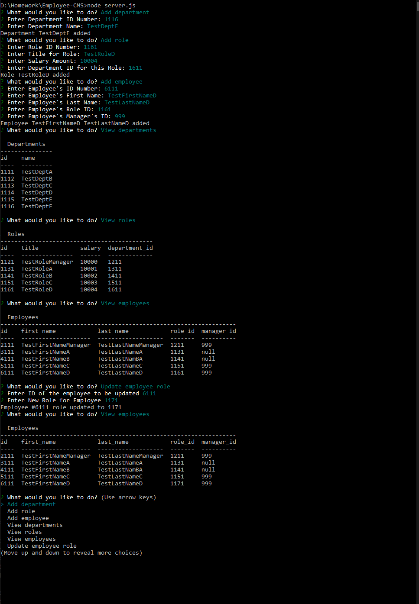

# Employee-CMS

## Description 

Content Management System for managing employee related information

## Table of Contents

* [Installation](#installation)
* [Usage](#usage)
* [License](#license)
* [Contributing](#contributing)
* [Screenshots](#screenshots)
        
## Installation

npm install

## Usage 

create database using schema.sql
enter SQL password into server.js
run 'node server.js' Employee-CMS root

## Video

https://www.youtube.com/watch?v=A6JllDl2trc&feature=youtu.be&hd=1

## Screenshots

## Questions

Contact
davis.sjoberg@gmail.com

        